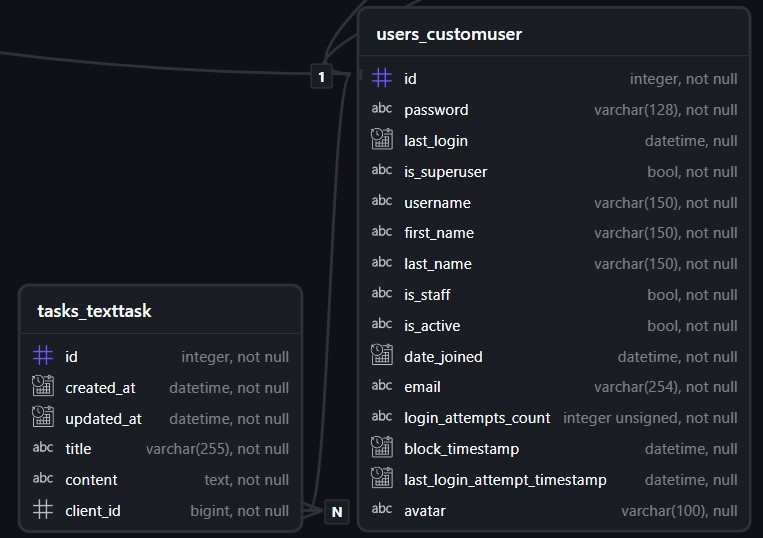

# HumanAIVerify

[](https://gitlab.crja72.ru/django/2025/autumn/course/projects/team-7/-/commits/develop)

HumanAIVerify is a service for checking content for signs of AI by humans. Customer can upload text, image, or audio tasks and then performers with check it. To became a performer user need to pass AI-detection test on 10 points. Languages supported: English, Russian.

## Requirements

Before starting work, make sure that you have installed:

- **Python** (versions 3.10-3.13) - [download](https://www.python.org/downloads/)
- **Git** - [download](https://git-scm.com/downloads)
- **Gettext** (for localization) - [installation instructions for Windows](https://docs.djangoproject.com/en/stable/topics/i18n/translation/#gettext-on-windows)

## Project Launch

### 1. Clone repository

```commandline
git clone https://gitlab.crja72.ru/django/2025/autumn/course/projects/team-7
```

### 2. Go to the project folder

```commandline
cd team-7
```

### 3. Create a virtual environment

Linux/macOS:

```bash
python3 -m venv venv
```  

Windows:

```batch
python -m venv venv
```  

### 4. Activate the virtual environment

Linux/macOS:

```bash
source venv/bin/activate
```  

Windows:

```batch
.\venv\Scripts\activate.bat
```  

### 5. Install the necessary libraries in the virtual environment

Production (minimum set):

```commandline
pip install -r requirements/prod.txt
```

Development (production + development tools):

```commandline
pip install -r requirements/prod.txt
pip install -r requirements/dev.txt
```

Testing (production + testing tools):

```commandline
pip install -r requirements/prod.txt
pip install -r requirements/test.txt
```

Full development setup (all at once):

```commandline
pip install -r requirements/prod.txt
pip install -r requirements/dev.txt
pip install -r requirements/test.txt
```

### 6. Copy the configuration template and edit the file.env to suit your needs

Linux/macOS:

```bash
cp .env.example .env
```

Windows:

```batch
copy .env.example .env
```

### 7. Go to the django_project folder

```commandline
cd django_project
```

### 8. Apply database migrations

Linux/macOS:

```bash
python3 manage.py migrate
```

Windows:

```batch
python manage.py migrate
```

### 9. Compile translations files

Supported languages: English, Russian

```commandline
django-admin compilemessages
```

### 10. When running in prod mode, collect static

Linux/macOS:

```bash
python3 manage.py collectstatic
```

Windows:

```batch
python manage.py collectstatic
```

### 11. Create superuser (optional)

Linux/macOS:

```bash
python3 manage.py createsuperuser
```

Windows:

```batch
python manage.py createsuperuser
```

### 12. Load fixtures (optional)

Linux/macOS:

```bash
python3 manage.py loaddata fixtures/training_texts.json
```

Windows:

```batch
python manage.py loaddata fixtures/training_texts.json
```

### 13. Run server

Linux/macOS:

```bash
python3 manage.py runserver
```

Windows:

```batch
python manage.py runserver
```

### After the server is started, the application will be available at the following addresses

Site: <http://localhost:8000>

Admin Panel: <http://localhost:8000/admin>

## ER Diagram


